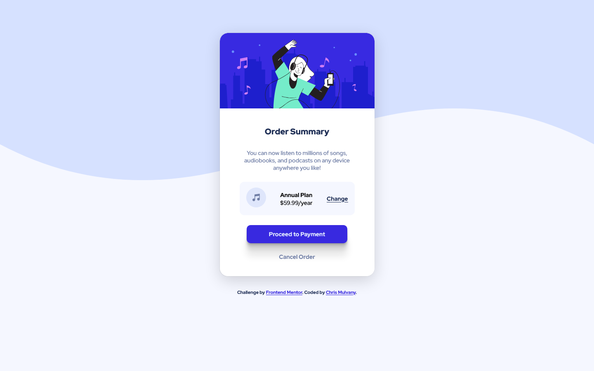

# Frontend Mentor - Order summary card solution

This is a solution to the [Order summary card challenge on Frontend Mentor](https://www.frontendmentor.io/challenges/order-summary-component-QlPmajDUj). Frontend Mentor challenges help you improve your coding skills by building realistic projects. 

## Table of contents

- [Overview](#overview)
  - [The challenge](#the-challenge)
  - [Screenshot](#screenshot)
  - [Links](#links)
- [My process](#my-process)
  - [Built with](#built-with)
  - [What I learned](#what-i-learned)
- [Author](#author)

## Overview

### The challenge

Users should be able to:

- See hover states for interactive elements

### Screenshot

### Links

- Solution URL: [Frontend Mentor](https://www.frontendmentor.io/challenges/order-summary-component-QlPmajDUj/hub/mobile-first-flexbox-css-order-summary-card-S1W3ALNSc)
- Live Site URL: [Github Pages](https://chrismulvanygh.github.io/order-summary-component/)

## My process

### Built with

- Semantic HTML5 markup
- CSS custom properties
- Flexbox
- Mobile-first workflow

### What I learned

Stop over thinking the small things, look for the simple solutions.

## Author

- Website - [Chris Mulvany](https://www.chrismulvany.com)
- Frontend Mentor - [@ChrisMulvanyGH](https://www.frontendmentor.io/profile/ChrisMulvanyGH)
- Twitter - [@ChrisMulvany](https://twitter.com/ChrisMulvany)
